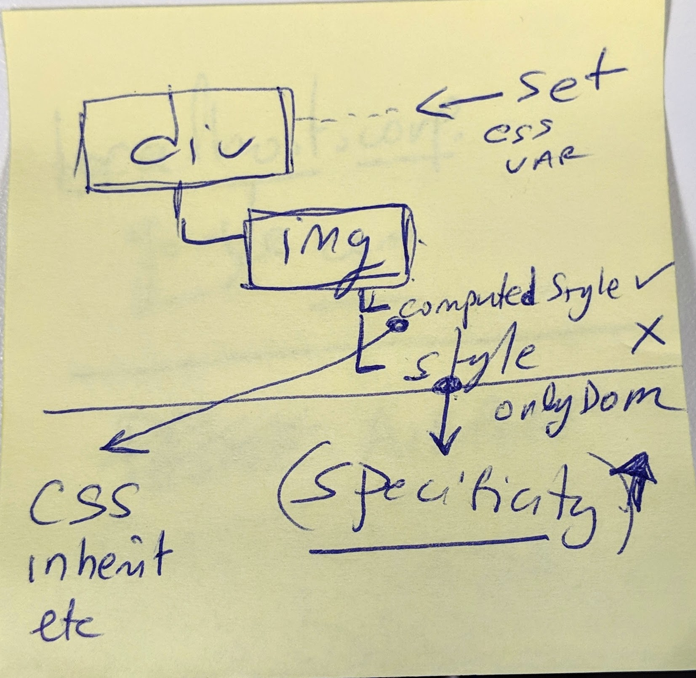

# Set / get custom properties / CSS variables

- <https://developer.mozilla.org/en-US/docs/Web/CSS/var>
- <https://developer.mozilla.org/en-US/docs/Web/CSS/--*>
- <https://developer.mozilla.org/en-US/docs/Web/CSS/:root>
- <https://developer.mozilla.org/en-US/docs/Web/API/Window/getComputedStyle>
- <https://zellwk.com/blog/css-values-in-js/>
- <https://stackoverflow.com/questions/41725725/access-css-variable-from-javascript>
- <https://www.broken-links.com/2014/08/28/css-variables-updating-custom-properties-javascript/>

# More about styles vs computed styles

# Crop rectangular image to square

- How is rectangular image displayed into a square

  - `object-fit` _show in this sample_
    - css `object-fit` property <http://tinyurl.com/pfkyutm>
      - using `object-fit` <https://stackoverflow.com/a/38926886/2085356>
    - `background-size:cover` and `background-image` _show in this sample_
      - <https://stackoverflow.com/a/28673116/2085356>
      - <https://developer.mozilla.org/en-US/docs/Web/CSS/background-position>
    - `overflow:hidden`
      - not center crop <https://stackoverflow.com/a/15167593/2085356>
    - `overflow:hidden` and js to change the css so that it center crops
      - <https://stackoverflow.com/a/22024658/2085356>
      - blog post <http://tinyurl.com/y3fzcoav>
      - responsive ex: <http://tinyurl.com/y6gekvsu>

# References

- <https://stackoverflow.com/questions/15167545/how-to-crop-a-rectangular-image-into-a-square-with-css>
- <https://developer.mozilla.org/en-US/docs/Web/API/CSSStyleDeclaration/setProperty>
- <https://developer.mozilla.org/en-US/docs/Web/API/CSSStyleDeclaration/getPropertyValue>
